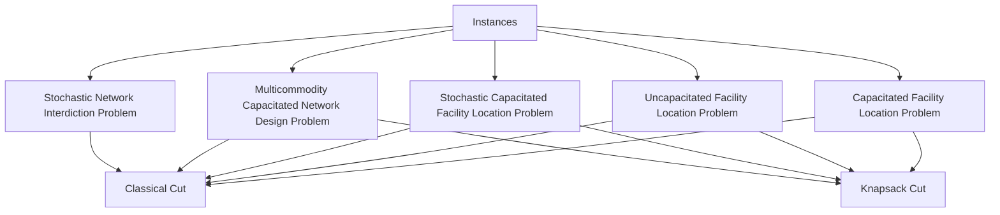

```@meta
EditURL = "intro.jl"
```

# Introduction

In this package, we provide some instances and some cut strategies.



---

*This page was generated using [Literate.jl](https://github.com/fredrikekre/Literate.jl).*

