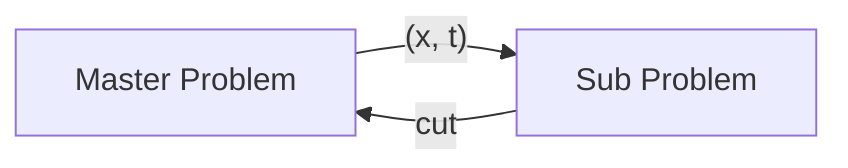
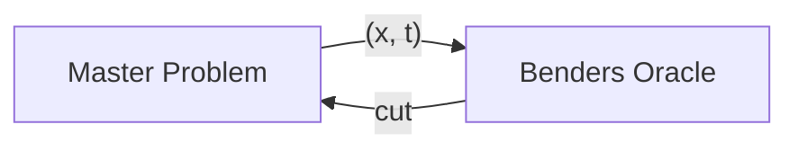

```@meta
EditURL = "introduction.jl"
```

# Introduction

BendersDecomposition.jl is a package for solving optimization problems using Benders Decomposition.

## A brief introduction to Benders Decomposition

Now, there are a lot of papers about Benders Decomposition, and they provide a lot of formulations to describe the Benders Decomposition.
However, here, we will provide a simple and intuitive explanation of the Benders Decomposition from the perspective of the Mixed-Integer Linear Programming.

The core concept of Benders decomposition is to divide the original problem into a master problem and one or more subproblems. The algorithm iteratively generates optimality and feasibility cuts, progressively refining the solution until convergence to the global optimum.
Consider this problem:

```math
\begin{aligned}
\min_{y\geq0} \ & c^Tx+d^Ty  \\
\text{s.t.} \ & Ax+By\geq b \\
                & D x \geq h \\
              & x \in \mathbb{Z}^{n_{x}}
\end{aligned}
```

We can break this problem into the master problem:

```math
\begin{aligned}
\min_{x} \ & c^Tx+t  \\
\text{s.t.} \ & D x \geq h \\
              & x \in \mathbb{Z}^{n_{x}}
\end{aligned}
```

and the subproblem:

```math
\begin{aligned}
\min_{y} \ & d^Ty  \\
\text{s.t.} \ & By\geq b - A \hat{x} \\
              & y \geq 0
\end{aligned}
```

Here, we focus on the iterative algorithm provided in the textbook[link].
At each iteration, we solve the master problem and get the solution $\hat{x}$,
then input $\hat{x}$ into the subproblem and solve it.
It's not easy to generate the cut between the $x$ and $t$ in the subproblem, so we consider the dual of the subproblem.
The dual of the subproblem is:

```math
\begin{aligned}
\max_{\pi} \ & (b-A\hat{x})^T\pi  \\
\text{s.t.} \ & B^T\pi \leq d
\end{aligned}
```

If the dual of the subproblem is **optimal**, we can get the extreme point $\hat{\pi}$ and generate the **optimality cut** for the master problem, like this: $t \geq \hat{\pi}^T (b-A\hat{x})$.
If the dual of the subproblem is **infeasible**, we can get the extreme ray $\tilde{\pi}$ and generate the **feasibility cut** for the master problem, like this: $0 \geq \tilde{\pi}^T (b-A\hat{x})$.

Fianlly, we can get the problem:

```math
\begin{aligned}
\min_{x} \ & c^Tx+t  \\
\text{s.t.} \ & t \ge \hat \pi^T (b-Ax), \ \forall \hat \pi \in \mathcal J \\
                & 0 \ge \tilde \pi^T (b-Ax), \ \forall \tilde \pi \in \mathcal R \\
                & D x \geq h \\
              & x \in \mathbb{Z}^{n_{x}}
\end{aligned}
```

where $\mathcal{J}$ and $\mathcal{R}$ respectively represent the set of all extreme points and rays of the dual of the inner continuous problem:

## What is the Benders Oracle
Benders Oracle is a function that takes a solution to the master problem and returns a cut that is violated by the solution. Normally, the Benders Oracle is implemented by solving the subproblem. But in some cases, the subproblem is not easy to solve, researchers have proposed some other problems to receive the point from the master problem and return the cut.

If use the picture to describe the traditional Benders decomposition, it is like this:



Similarly, if use the picture to describe the Benders decomposition with Benders Oracle, it is like this:



## Design of BendersDecomposition.jl

BendersDecomposition.jl is designed to be a flexible and extensible package for solving optimization problems using Benders Decomposition.

The package is designed to be modular, with each component being responsible for a specific task.

For beginners, please refer to the [Beginner Tutorial](beginner.md).

For more advanced users, please refer to the [Advanced Tutorial](advanced.md).

---

*This page was generated using [Literate.jl](https://github.com/fredrikekre/Literate.jl).*

