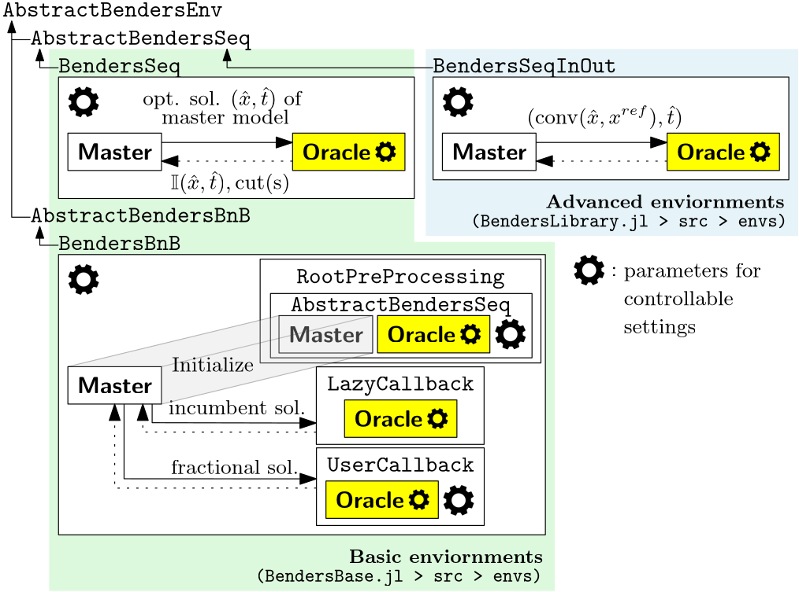
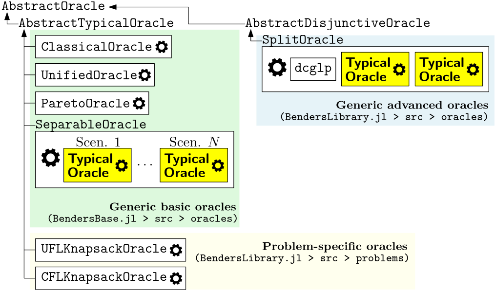

# [User Guide](@id user-guide)

## BendersX Components
**BendersX.jl** is built on the principle that Benders decomposition consists of **clearly defined, separable components**, each with a distinct role. By making these components explicit, the framework enables **composable and extensible algorithm design**.

BendersX.jl decomposes the Benders decomposition algorithm into three core components: the **Master**, the **Oracle**, and the **Environment**.
Each component has a well-defined responsibility and can be independently replaced or extended.

### Master
The **Master** represents the master problem in a Benders decomposition and is responsible for proposing candidate solutions.

Conceptually, the Master:
- represents the current relaxation of the Benders reformulation
- refines this relaxation by incorporating newly generated Benders cuts, and
- produces candidate solutions for evaluation.

In BendersX.jl, the Master is:
- is encapsulated by a subtype of `AbstractMaster`
- owns a JuMP model defining the master problem, and
- accepts newly generated Benders cuts during the solution process.

### Oracle
An **Oracle** encapsulates all procedures related to **cut generation** at a given separation point.

In BendersX.jl, an Oracle:
- is implemented as a subtype of `AbstractOracle`
- is fully decoupled from the Master and Environment, and
- focuses exclusively on cut generation.

Oracle behavior can be configured via parameters, such as violation tolerances and cut selection rules.

### Environment
The **Environment** controls the **execution logic** of the Benders algorithm.

While the Master and Oracle define *what* problems are solved and *how* cuts are generated, the Environment defines *how the algorithm proceeds*. Specifically, it:
- orchestrates the interaction between the Master and Oracle,
- manages iteration order and termination criteria, and
- handles logging, statistics, and output.

In BendersX.jl, an Environment:
- is implemented as a subtype of `AbstractBendersEnv`
- encapsulates the overall control flow of the algorithm, and
- enables alternative execution strategies to be expressed cleanly.

Environment behavior can be adjusted via parameters (e.g., stopping rules, stabilization dynamics) and configurable subcomponents (e.g., root preprocessing, callbacks).

--- 

## Hierarchical Architecture
Each component follows a clear type hierarchy that supports specialization and reuse. This hierarchy allows advanced users to extend existing implementations incrementally rather than implementing full components from scratch.

### Environment



### Oracle


## Adding New Oracles
Advanced users can implement custom cut generators by defining a new oracle:
```julia
import BendersX: AbstractOracle, generate_cuts

struct MyOracle <: AbstractOracle
    # fields
end
```
together with the required interface:
```julia
function generate_cuts(oracle::MyOracle)::Tuple
    # return a collection of cuts
end
```
This interface-based design allows new algorithmic ideas to be prototyped directly within the framework.


## Adding New Environments
Custom execution logic can be implemented by defining a new Environment:
```julia
import BendersX: AbstractBendersEnv

struct MyEnv <: AbstractBendersEnv
    # fields
end
```
together with the required execution method:
```julia
function solve!(env::MyEnv)::DataFrame
    # execution logic
end
```

---

## Rule of Thumb
- If you are changing *which cuts are generated*, customize the Oracle.
- If you are changing *how the algorithm runs*, customize the Environment.
